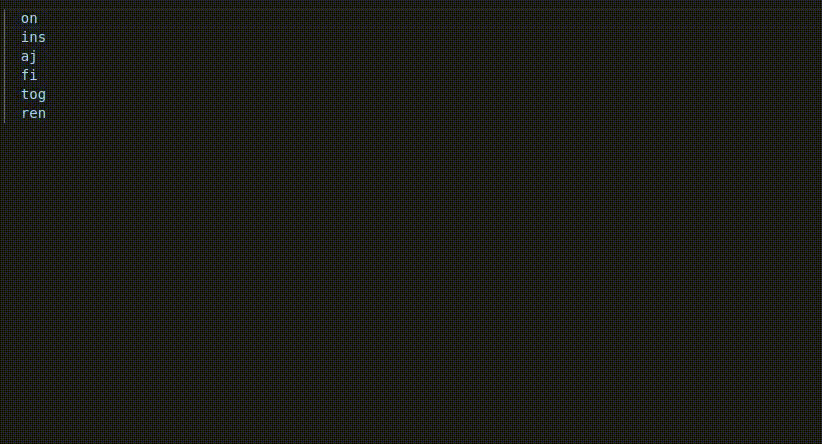
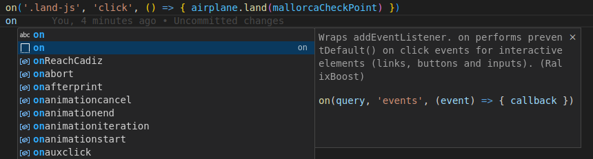
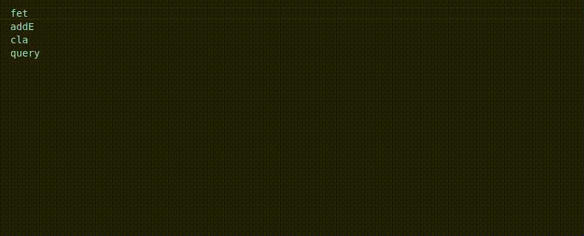

# RalixBoost for Visual Studio Code

A Visual Studio Code extension providing snippets for the [Ralix framework](https://github.com/ralixjs/ralix) that provides barebones and utilities to help enhance your server-side rendered webapps.

## Installation

You can install this extension directly from Visual Studio Code. Search for "RalixBoost" in the Extensions marketplace and install it.

## Features

Explore the key features of this extension that make working with the Ralix framework more convenient:

- Start searching for the function you need, and you can complete it simply by using the tab key.

  

- You can also read the documentation for each function.

  

- New to Ralix? No problem! The extension also works if you start searching for the equivalent of what you need in vanilla JavaScript.

  
